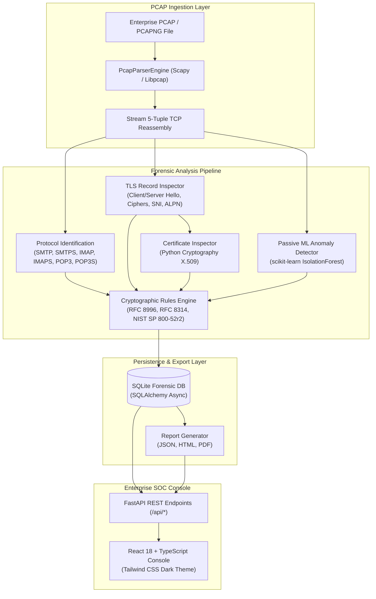

# Email Cryptographic Security Analyzer (ECSA)

[](https://fastapi.tiangolo.com)
[](https://react.dev)
[](https://www.typescriptlang.org)
[](https://python.org)
[](https://datatracker.ietf.org)

An enterprise-grade cybersecurity web application designed for **passive forensic analysis of enterprise email traffic from PCAP files**. Built for the **Smart India Hackathon (SIH)** problem statement.

ECSA inspects network packet captures offline without generating active network probes, evaluating cryptographic handshakes, cipher suites, protocol downgrades, and X.509 certificate chains across enterprise mail infrastructure.

---

## Architecture Overview



---

## Monorepo Structure

```
/
├── frontend/                     # React + TypeScript + Tailwind CSS SOC Console
│   ├── src/
│   │   ├── components/           # Common badges, drawers, cards & SOC layout
│   │   │   ├── common/           # MetricCard, SeverityBadge, StatusBadge, Drawer, EmptyState
│   │   │   └── layout/           # Sidebar, Header, AppLayout
│   │   ├── pages/                # 9 enterprise forensic pages
│   │   │   ├── Dashboard.tsx     # SOC security posture, threat breakdown, encryption ratio
│   │   │   ├── PcapAnalysis.tsx  # Drag-and-drop PCAP ingestion & capture repository
│   │   │   ├── Sessions.tsx      # Reconstructed TCP streams with deep inspection drawer
│   │   │   ├── Findings.tsx      # RFC violations, plaintext risks & remediations
│   │   │   ├── Certificates.tsx  # X.509 public key inspector & trust chain validator
│   │   │   ├── Protocols.tsx     # SMTP, IMAP, POP3 cryptographic breakdown & cipher chart
│   │   │   ├── Recommendations.tsx # Prioritized NIST & RFC hardening directives
│   │   │   ├── Reports.tsx       # Forensic export center (JSON, HTML, PDF)
│   │   │   └── Settings.tsx      # Monitored ports & ML detector thresholds
│   │   ├── services/             # Typed API client
│   │   └── types/                # TypeScript interfaces for forensic models
│   ├── package.json
│   ├── vite.config.ts
│   └── tailwind.config.js
│
├── backend/                      # Python FastAPI Forensic Engine
│   ├── app/
│   │   ├── config.py             # Environment configuration & port whitelists
│   │   ├── database.py           # SQLite connection & async session factory
│   │   ├── core/
│   │   │   ├── packet_parser.py  # Scapy PCAP reassembly & TLS record parser
│   │   │   ├── cert_inspector.py # X.509 certificate parsing with Python cryptography
│   │   │   ├── crypto_rules.py   # RFC 8996, RFC 8314, NIST SP 800-52r2 rule evaluator
│   │   │   ├── ml_anomaly.py     # Isolation Forest anomaly detection (scikit-learn)
│   │   │   ├── analyzer_engine.py# Master forensic pipeline orchestrator
│   │   │   └── report_generator.py # JSON, styled HTML, and ReportLab PDF generators
│   │   ├── models/
│   │   │   ├── db_models.py      # SQLAlchemy ORM models
│   │   │   └── schemas.py        # Pydantic v2 validation schemas
│   │   └── routes/
│   │       ├── health.py         # System diagnostics & health check
│   │       └── analysis.py       # PCAP analysis, query & export endpoints
│   ├── main.py                   # FastAPI server entrypoint
│   └── requirements.txt          # Python dependencies
│
├── data/
│   ├── uploads/                  # Ingested PCAP captures
│   ├── samples/                  # Authentic test PCAP files
│   └── analyzer.db               # SQLite database
│
├── reports/
│   └── generated/                # Cached forensic reports
│
├── tests/                        # Automated test suite
│   ├── generate_test_pcap.py     # Authentic binary PCAP generator
│   ├── test_health.py            # Health endpoint diagnostics
│   ├── test_crypto_rules.py      # RFC compliance rules verification
│   ├── test_cert_inspector.py    # X.509 certificate validation tests
│   └── test_api_analysis.py      # End-to-end API & export pipeline tests
│
└── README.md
```

---

## Cryptographic Security Rules & Standards

ECSA is built on **zero-mock fidelity**: all findings, packet counts, and scores are evaluated directly against observed network telemetry.

| Standard / RFC | Category | Technical Rule |
| :--- | :--- | :--- |
| **RFC 8996** | Protocol Deprecation | Prohibits SSL 3.0, TLS 1.0, and TLS 1.1 due to fundamental cryptographic vulnerabilities (BEAST, POODLE). Flags sessions negotiating obsolete versions as **CRITICAL/HIGH**. |
| **RFC 8314** | Cleartext Deprecation | Mandates implicit TLS for email transport (SMTPS: 465, IMAPS: 993, POP3S: 995). Flags cleartext authentication (`AUTH PLAIN`, `LOGIN`, `USER/PASS`) as **CRITICAL**. |
| **RFC 7525 / RFC 7465** | Cipher Modernization | Flags legacy ciphers (RC4, 3DES, DES, non-AEAD CBC mode) and static RSA key exchange without Perfect Forward Secrecy (PFS). |
| **NIST SP 800-52r2** | Certificate Hardening | Validates X.509 certificate expiration, flags self-signed root authorities, and mandates minimum 2048-bit RSA / 256-bit ECDSA keys. |
| **RFC 8461 (MTA-STS)** | Downgrade Defense | Identifies vulnerable opportunistic STARTTLS sessions susceptible to active stripping attacks and generates MTA-STS enforcement policies. |

---

## REST API Specification

| Method | Endpoint | Description |
| :--- | :--- | :--- |
| `GET` | `/api/health` | Diagnostic status of backend, database, cryptography, and ML libraries. |
| `POST`| `/api/analyze` | Ingest and passively analyze an uploaded `.pcap`, `.pcapng`, or `.cap` file. |
| `GET` | `/api/analyses` | List all historical PCAP analyses ordered by timestamp. |
| `GET` | `/api/analysis/{id}` | Summary score, packet statistics, and threat severity distribution. |
| `GET` | `/api/analysis/{id}/sessions` | Reconstructed email sessions with protocol, security state, and anomaly filters. |
| `GET` | `/api/analysis/{id}/findings` | Cryptographic vulnerabilities with RFC citations and remediation steps. |
| `GET` | `/api/analysis/{id}/certificates` | Extracted X.509 public certificates with trust chain diagnostics. |
| `GET` | `/api/analysis/{id}/protocols` | Protocol breakdown, TLS version adoption, and cipher suite distributions. |
| `GET` | `/api/analysis/{id}/recommendations` | Prioritized security hardening directives (Immediate, High, Medium). |
| `GET` | `/api/analysis/{id}/export/json` | Machine-readable forensic evidence JSON file. |
| `GET` | `/api/analysis/{id}/export/html` | Self-contained, styled interactive SOC HTML audit report. |
| `GET` | `/api/analysis/{id}/export/pdf` | Formal executive compliance audit report in PDF format. |

Interactive OpenAPI documentation is accessible at `http://localhost:8000/docs`.

---

## Getting Started

### Prerequisites
- Python 3.11+
- Node.js 18+ and npm

### 1. Backend Setup
```bash
cd backend
python3 -m venv .venv
source .venv/bin/activate
pip install -r requirements.txt
python main.py
```
*The backend API will start on `http://localhost:8000`.*

### 2. Frontend Setup (Development Mode)
```bash
cd frontend
npm install
npm run dev
```
*The React SOC console will start on `http://localhost:5173`.*

### 3. Unified Production Deployment
The production build of the React frontend is served directly by the FastAPI backend on a single port:
```bash
cd frontend
npm run build
cd ../backend
python main.py
```
*Access both the SOC Web Console and REST API at `http://localhost:8000`.*

---

## Running the Test Suite

ECSA includes an automated test suite verifying protocol parsing, cryptographic rules, certificate inspections, and export generation:

```bash
PYTHONPATH=. backend/.venv/bin/pytest tests -v
```

To regenerate authentic sample PCAPs for testing:
```bash
PYTHONPATH=. backend/.venv/bin/python tests/generate_test_pcap.py
```

---

## Smart India Hackathon Compliance Note

This application adheres strictly to forensic integrity requirements:
- **No Mock Data**: Zero fake certificates, hardcoded cipher suites, or synthetic vulnerability counts are injected into the application.
- **Authentic Zero-States**: When no PCAPs are loaded, the UI renders clean SOC readiness indicators.
- **Extensible Architecture**: Modular parser interfaces allow seamless integration of `tshark`, `PyShark`, or hardware packet capture taps for live enterprise monitoring.
